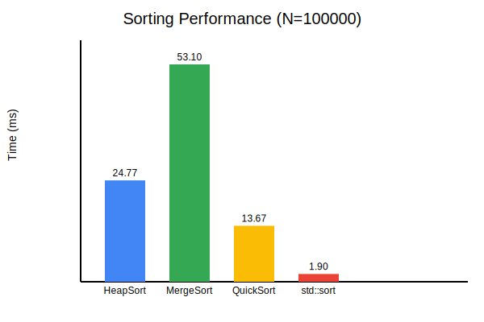

Algorithm Comparisons
Overview
This repository contains detailed comparative analyses of various algorithms. It includes two main studies:

1- Spell Checker Algorithms - A comparison of Linear List, BBST (Balanced Binary Search Tree), Trie, and Hash Map algorithms in terms of efficiency in spell checking tasks.

2- Single Pattern Matching Algorithms - An evaluation of Brute-Force, Sunday, KMP, FSM, Rabin-Karp, and Gusfield Z algorithms for finding a specific pattern within a larger text.

3- Sorting Algorithms Comparison - Benchmark of QuickSort, MergeSort, and HeapSort with performance visualization.
4- Pathfinding Visualization - Interactive CLI visualizer for Dijkstra and A* algorithms.

## Repository Structure

### [Sorting_Algorithms_Comparison/](Sorting_Algorithms_Comparison/)
Contains implementations of various sorting algorithms and a benchmarking tool.
- **Algorithms**: QuickSort, MergeSort, HeapSort, std::sort
- **Benchmark**: Compares execution time for N=10k and N=100k elements.



### [Pathfinding_Visualization/](Pathfinding_Visualization/)
A CLI-based visualization of pathfinding algorithms on a grid map.
- **Algorithms**: Dijkstra, A*
- **Features**: ASCII visualization of the search process and final path.

```
####################
#S                 #
#*  #########      #
#*  #       #      #
#***#   E   #      #
#  *#   *   #      #
#  *####*####      #
#  ******          #
####################
```

### [Spell_Checker_Algorithms_Comparison](Spell_Checker_Algorithms_Comparison/)
Contains the study comparing the efficiency of different spell checker algorithms based on build time and check time.

### [Pattern_Matching_Algorithms_Comparison](Pattern_Matching_Algorithms_Comparison/)
Presents the analysis of various single pattern matching algorithms, focusing on their performance with both short and long patterns.

Methodology
All algorithms were implemented in C++ and tested on consistent datasets. The performance metrics include execution times for different scenarios, providing insights into the strengths and weaknesses of each algorithm.

Results

Spell Checker Algorithms:
-BBST and Trie offer the fastest check times.
-Hash Map has the fastest build time.
-Linear List, while simple, is less efficient overall.

### Pattern Matching Algorithms:
- The Sunday algorithm is the most efficient for both short and long patterns.
- The FSM algorithm is the least efficient.
- Rabin-Karp performs well, especially for longer patterns.

### Sorting Algorithms:
- **std::sort** (IntroSort) consistently outperforms custom implementations due to deep optimizations.
- **QuickSort** is the fastest among the custom implementations.
- **MergeSort** is stable but slower due to memory allocations.
- **HeapSort** is slower than QuickSort but provides O(N log N) worst-case guarantee.

Conclusion
These studies offer valuable insights for developers and researchers interested in algorithm efficiency, particularly in the context of spell checking and pattern matching. The results can guide the selection of algorithms based on specific use cases.

Contributions
Contributions and discussions are welcome. If you have suggestions for improving the analyses or want to add new algorithm comparisons, feel free to submit a pull request or open an issue.
